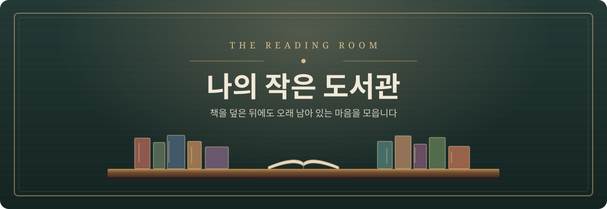

  <strong>읽은 책을 한 권씩 꽂고, 덮은 뒤의 마음을 남기는 나의 작은 도서관 입니다.</strong> 
  책등을 누르면 첫 장의 짧은 감상에서 시작해 다음 장의 독후감으로 이어집니다.

  <a href="https://ryuyg.github.io/MyLittleLibary/"><strong>📖 책장 열어보기 →</strong></a>

 

## 01 · 책장에 꽂힌 책

|  | 책과 작가 | 읽은 날 |
| :---: | :--- | :---: |
| 📕 | **니체의 가르침, 단독자로 살아라** 프리드리히 니체 | 2026.09.25 |

 

> “좋았던 책은 덮은 뒤에도 내 안에서 계속 읽힌다.”

— 조금씩 채워가는 나만의 독서 기록

